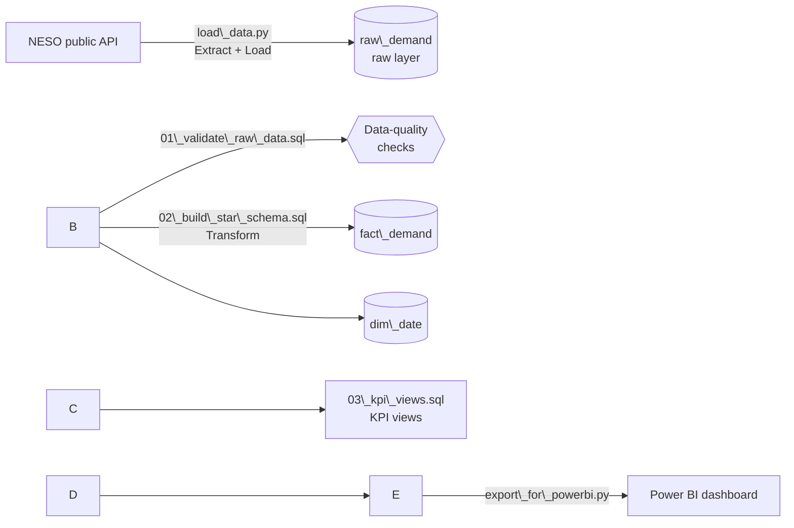

# GB Electricity Demand: SQL Data Pipeline \& KPI Layer

An end-to-end data pipeline that extracts half-hourly electricity demand for Great Britain
from the **National Energy System Operator (NESO) public API**, loads it into a SQL database,
validates and cleans it, models it as a **star schema**, and serves **KPI views** to a
Power BI dashboard.

**Tech:** Python (standard library) · SQLite · SQL (CTEs, recursive CTEs, window functions) · Power BI

<!-- Add your dashboard screenshot here once built:
!\[Dashboard](docs/dashboard.png)

\---

## Pipeline



|Stage|File|What it does|
|-|-|-|
|**Extract \& Load**|`load\_data.py`|Pages through the NESO API and loads every record, unchanged, into `raw\_demand`|
|**Validate**|`sql/01\_validate\_raw\_data.sql`|Profiles volume, duplicates, completeness, nulls and impossible values|
|**Transform**|`sql/02\_build\_star\_schema.sql`|Builds a calendar dimension and a cleaned, de-duplicated fact table|
|**Serve**|`sql/03\_kpi\_views.sql`|Daily, hourly and monthly KPI views, plus a data-quality monitoring view|
|**Visualise**|`export\_for\_powerbi.py`|Exports the views to CSV for Power BI|

## Key results

**Data quality** (2026 load, 1 Jan to 13 Sep 2026)

* **12,286** half-hourly records over **256 days**, with **no duplicates, forecasts, nulls or invalid values**.
* Row counts **reconcile** between the raw and clean layers (12,286 → 12,286) and against the calendar:
255 standard days × 48 periods + 1 clock-change day × 46 periods = 12,286.
* **One apparent anomaly investigated:** 29 March has only 46 half-hour periods. That's the
switch to British Summer Time (a 23-hour day), so it isn't missing data. An earlier
Python analysis had reported two "missing timestamps" on this date; the real cause was timestamp logic that
assumed 48 periods every day. The data model now derives *expected* periods from the
calendar, so genuine gaps are flagged and clock changes are not.

**Demand insights**

* Average national demand falls **\~34% from winter to summer**: 32,887 MW in January vs 21,849 MW in July.
* Highest half-hourly demand: **47,382 MW** (January).
* Embedded solar generation rises **\~6.8x** from January (0.49m MWh) to July (3.32m MWh).
* Demand turns upward again from August (+1.0%) into September (+4.9%).

\*\*Analysis findings\*\* (`sql/04\_business\_questions.sql`)

\- \*\*Weekend demand is \~11% lower\*\* than weekday demand. Thursday is the highest-demand day; Monday and

&#x20; Friday are the lowest weekdays because bank holidays fall on them.

\- \*\*Solar suppresses grid demand:\*\* on the 10 sunniest summer weekdays, midday grid demand was

&#x20; 4,680 MW (\~19%) lower than on the 10 least sunny, alongside 7,823 MW more embedded solar.

&#x20; This is a correlation only: sunnier days are also warmer, so temperature is a confounder.

\- \*\*Anomaly detection was iterated:\*\* a first z-score check against monthly averages mostly flagged

&#x20; ordinary weekends. Splitting the baseline by weekday/weekend surfaced the real events: New Year's Day

&#x20; (−6,472 MW) and the late-May bank holiday (−3,035 MW). High anomalies clustered in early March and April,

&#x20; which shows the limit of a monthly baseline while demand is trending downward. A rolling baseline is the next improvement.Data model

A star schema: one fact table at half-hour grain, joined to a calendar dimension.

```mermaid
erDiagram
    dim\_date ||--o{ fact\_demand : "date\_key"
    dim\_date {
        TEXT date\_key PK
        INTEGER month
        TEXT day\_name
        INTEGER is\_weekend
        INTEGER periods\_in\_day "expected: 46 / 48 / 50"
        INTEGER is\_clock\_change
    }
    fact\_demand {
        TEXT date\_key PK, FK
        INTEGER settlement\_period PK
        TEXT period\_start
        INTEGER hour\_of\_day
        INTEGER national\_demand\_mw
        INTEGER embedded\_solar\_mw
        INTEGER embedded\_wind\_mw
    }
```

**Design decisions**

* **The raw layer is kept untouched.** `raw\_demand` stores the data exactly as received, so any
cleaning step can be audited or re-run without calling the API again.
* **Expected completeness comes from the calendar, not the data.** `dim\_date` is generated with a
recursive CTE covering every date in range. Clock-change Sundays are given 46 or 50 periods by rule.
If expected counts were derived from the data itself, a day with a missing half-hour would pass silently.
* **De-duplication is deterministic.** `ROW\_NUMBER()` keeps the most recently loaded row for each
(date, period), so re-loading data never creates double counts.
* **Business logic lives in SQL views,** not in the dashboard, so every KPI is defined once,
version-controlled and documented.
* **Data quality is monitored, not just checked once.** `v\_data\_quality` (built with a `LEFT JOIN`
from the calendar) lists any day whose recorded periods differ from expected, including days
with no data at all. It is currently empty.

### Cleaning rules (applied in `02\_build\_star\_schema.sql`)

1. Keep actuals only (`FORECAST\_ACTUAL\_INDICATOR = 'A'`).
2. One row per (date, settlement period); if duplicated, keep the most recently loaded.
3. Exclude rows where demand is missing or ≤ 0.
4. Exclude clock-change days from hour-of-day analysis (the period-to-clock-time mapping is approximate on those days).

### KPI views (`03\_kpi\_views.sql`)

|View|Grain|Measures|
|-|-|-|
|`v\_daily\_kpis`|Day|Peak, minimum and average demand (MW); demand, solar and wind energy (MWh); embedded renewables %; periods recorded vs expected|
|`v\_hourly\_profile`|Hour × weekday/weekend|Average demand and solar by hour of day|
|`v\_monthly\_summary`|Month|Average and peak demand, solar MWh, month-on-month change (`LAG`)|
|`v\_data\_quality`|Day|Days where recorded periods ≠ expected (should be empty)|

## Data dictionary

Source: [NESO Data Portal – Historic Demand Data 2026](https://www.neso.energy/data-portal/historic-demand-data)
(published about 21 days in arrears).

|Column (raw)|Meaning|
|-|-|
|`SETTLEMENT\_DATE`|Date of the half-hour (follows clock changes)|
|`SETTLEMENT\_PERIOD`|Half-hour number; 1 = 00:00–00:30. 1–48 normally; 46 or 50 on clock-change days|
|`ND`|National Demand (MW): GB demand met by transmission-connected generation|
|`TSD`|Transmission System Demand (MW): ND plus station load, pumped storage and exports|
|`ENGLAND\_WALES\_DEMAND`|As ND, England and Wales only (MW)|
|`EMBEDDED\_WIND\_GENERATION` / `\_SOLAR\_`|Estimated output of wind/solar not metered by the transmission system (MW)|
|`EMBEDDED\_WIND\_CAPACITY` / `\_SOLAR\_`|Installed embedded capacity (MW)|
|`FORECAST\_ACTUAL\_INDICATOR`|`A` = actual, `F` = forecast|

## How to run

Requirements: Python 3.8+ (no extra packages) and [DB Browser for SQLite](https://sqlitebrowser.org/)
or any SQLite client.

```bash
python load\_data.py                                  # 1. extract + load -> neso.db
python run\_sql.py sql/01\_validate\_raw\_data.sql       # 2. validate
python run\_sql.py sql/02\_build\_star\_schema.sql       # 3. transform
python run\_sql.py sql/03\_kpi\_views.sql               # 4. KPI views
python export\_for\_powerbi.py                         # 5. CSVs in exports/ for Power BI
```

All SQL scripts can be re-run safely: each drops and rebuilds its own objects.
Maintenance and refresh steps are in [`docs/HANDOFF.md`](docs/HANDOFF.md).

## Known limitations

* **Partial month:** the data ends on 13 September, so September **totals** (e.g. solar MWh) are not
comparable with full months. Use averages, or label the month "Sep (partial)".
* **Clock changes:** settlement-period-to-clock-time conversion is approximate on the 46/50-period days.
The autumn change (25 Oct 2026, 50 periods) is handled by the model but isn't in the data yet.
* **Embedded generation** figures are NESO estimates, not metered values.
* The NESO resource ID for 2026 is hard-coded in `load\_data.py`; change it to load other years.

## Repository structure

```
├── load\_data.py              # Extract (NESO API) + Load (SQLite)
├── run\_sql.py                # Runs a .sql file and prints results
├── export\_for\_powerbi.py     # Exports KPI views to CSV
├── sql/
│   ├── 01\_validate\_raw\_data.sql
│   ├── 02\_build\_star\_schema.sql
│   └── 03\_kpi\_views.sql
├── exports/                  # CSV outputs for Power BI
└── docs/
    └── HANDOFF.md            # Refresh, maintenance and troubleshooting guide
```

