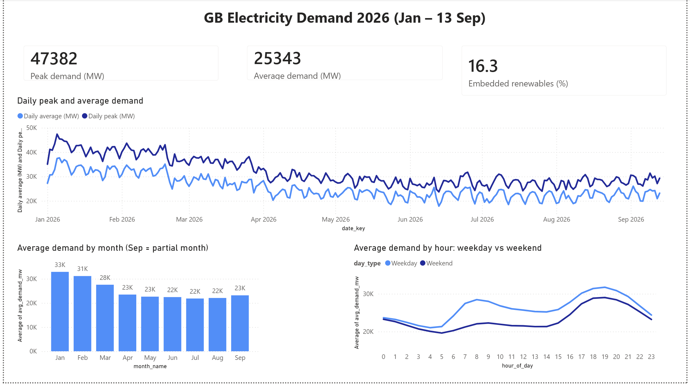
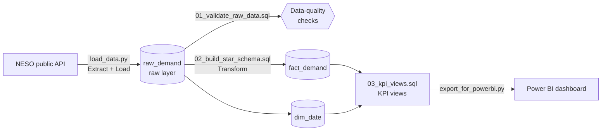
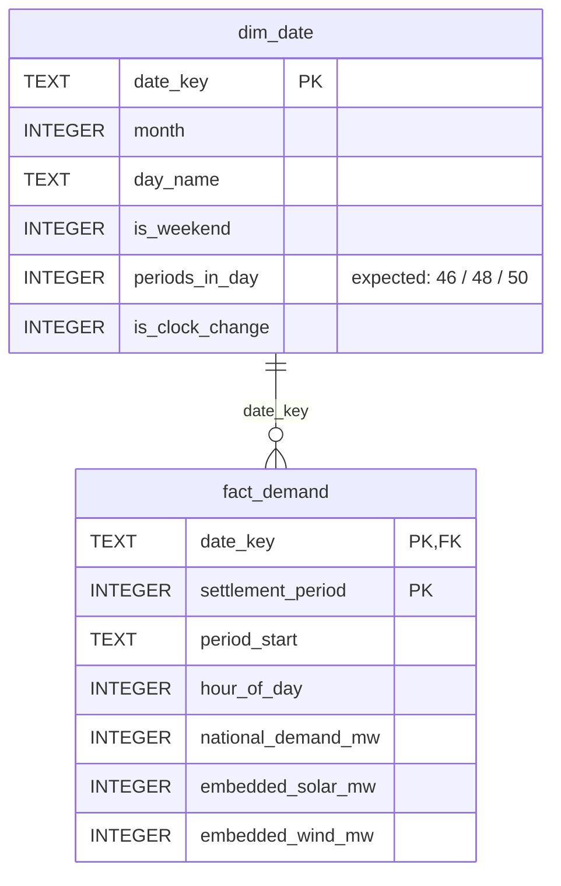

# GB Electricity Demand: SQL Data Pipeline & KPI Layer

An end-to-end data pipeline that extracts half-hourly electricity demand for Great Britain
from the **National Energy System Operator (NESO) public API**, loads it into a SQL database,
validates and cleans it, models it as a **star schema**, and serves **KPI views** to a
Power BI dashboard.

**Tech:** Python (standard library) · SQLite · SQL (CTEs, recursive CTEs, window functions) · Power BI

<!-- Add your dashboard screenshot here once built:

-->

---

## Pipeline



| Stage | File | What it does |
|---|---|---|
| **Extract & Load** | `load_data.py` | Pages through the NESO API and loads every record, unchanged, into `raw_demand` |
| **Validate** | `sql/01_validate_raw_data.sql` | Profiles volume, duplicates, completeness, nulls and impossible values |
| **Transform** | `sql/02_build_star_schema.sql` | Builds a calendar dimension and a cleaned, de-duplicated fact table |
| **Serve** | `sql/03_kpi_views.sql` | Daily, hourly and monthly KPI views, plus a data-quality monitoring view |
| **Visualise** | `export_for_powerbi.py` | Exports the views to CSV for Power BI |

## Key results

**Data quality** (2026 load, 1 Jan to 13 Sep 2026)
- **12,286** half-hourly records over **256 days**, with **no duplicates, forecasts, nulls or invalid values**.
- Row counts **reconcile** between the raw and clean layers (12,286 → 12,286) and against the calendar:
  255 standard days × 48 periods + 1 clock-change day × 46 periods = 12,286.
- **One apparent anomaly investigated:** 29 March has only 46 half-hour periods. That's the
  switch to British Summer Time (a 23-hour day), so it isn't missing data. An earlier
  Python analysis had reported two "missing timestamps" on this date; the real cause was timestamp logic that
  assumed 48 periods every day. The data model now derives *expected* periods from the
  calendar, so genuine gaps are flagged and clock changes are not.

**Demand insights**
- Average national demand falls **~34% from winter to summer**: 32,887 MW in January vs 21,849 MW in July.
- Highest half-hourly demand: **47,382 MW** (January).
- Embedded solar generation rises **~6.8x** from January (0.49m MWh) to July (3.32m MWh).
- Demand turns upward again from August (+1.0%) into September (+4.9%).

<!-- Add findings from 04_business_questions.sql here when complete, e.g.
- Weekend demand is __% lower than weekday demand.
- Anomaly detection flagged __ days (z-score > 2), mostly bank holidays: __.
-->

## Data model

A star schema: one fact table at half-hour grain, joined to a calendar dimension.



**Design decisions**
- **The raw layer is kept untouched.** `raw_demand` stores the data exactly as received, so any
  cleaning step can be audited or re-run without calling the API again.
- **Expected completeness comes from the calendar, not the data.** `dim_date` is generated with a
  recursive CTE covering every date in range. Clock-change Sundays are given 46 or 50 periods by rule.
  If expected counts were derived from the data itself, a day with a missing half-hour would pass silently.
- **De-duplication is deterministic.** `ROW_NUMBER()` keeps the most recently loaded row for each
  (date, period), so re-loading data never creates double counts.
- **Business logic lives in SQL views,** not in the dashboard, so every KPI is defined once,
  version-controlled and documented.
- **Data quality is monitored, not just checked once.** `v_data_quality` (built with a `LEFT JOIN`
  from the calendar) lists any day whose recorded periods differ from expected, including days
  with no data at all. It is currently empty.

### Cleaning rules (applied in `02_build_star_schema.sql`)
1. Keep actuals only (`FORECAST_ACTUAL_INDICATOR = 'A'`).
2. One row per (date, settlement period); if duplicated, keep the most recently loaded.
3. Exclude rows where demand is missing or ≤ 0.
4. Exclude clock-change days from hour-of-day analysis (the period-to-clock-time mapping is approximate on those days).

### KPI views (`03_kpi_views.sql`)
| View | Grain | Measures |
|---|---|---|
| `v_daily_kpis` | Day | Peak, minimum and average demand (MW); demand, solar and wind energy (MWh); embedded renewables %; periods recorded vs expected |
| `v_hourly_profile` | Hour × weekday/weekend | Average demand and solar by hour of day |
| `v_monthly_summary` | Month | Average and peak demand, solar MWh, month-on-month change (`LAG`) |
| `v_data_quality` | Day | Days where recorded periods ≠ expected (should be empty) |

## Data dictionary

Source: [NESO Data Portal – Historic Demand Data 2026](https://www.neso.energy/data-portal/historic-demand-data)
(published about 21 days in arrears).

| Column (raw) | Meaning |
|---|---|
| `SETTLEMENT_DATE` | Date of the half-hour (follows clock changes) |
| `SETTLEMENT_PERIOD` | Half-hour number; 1 = 00:00–00:30. 1–48 normally; 46 or 50 on clock-change days |
| `ND` | National Demand (MW): GB demand met by transmission-connected generation |
| `TSD` | Transmission System Demand (MW): ND plus station load, pumped storage and exports |
| `ENGLAND_WALES_DEMAND` | As ND, England and Wales only (MW) |
| `EMBEDDED_WIND_GENERATION` / `_SOLAR_` | Estimated output of wind/solar not metered by the transmission system (MW) |
| `EMBEDDED_WIND_CAPACITY` / `_SOLAR_` | Installed embedded capacity (MW) |
| `FORECAST_ACTUAL_INDICATOR` | `A` = actual, `F` = forecast |

## How to run

Requirements: Python 3.8+ (no extra packages) and [DB Browser for SQLite](https://sqlitebrowser.org/)
or any SQLite client.

```bash
python load_data.py                                  # 1. extract + load -> neso.db
python run_sql.py sql/01_validate_raw_data.sql       # 2. validate
python run_sql.py sql/02_build_star_schema.sql       # 3. transform
python run_sql.py sql/03_kpi_views.sql               # 4. KPI views
python export_for_powerbi.py                         # 5. CSVs in exports/ for Power BI
```

All SQL scripts can be re-run safely: each drops and rebuilds its own objects.
Maintenance and refresh steps are in [`docs/HANDOFF.md`](docs/HANDOFF.md).

## Known limitations
- **Partial month:** the data ends on 13 September, so September **totals** (e.g. solar MWh) are not
  comparable with full months. Use averages, or label the month "Sep (partial)".
- **Clock changes:** settlement-period-to-clock-time conversion is approximate on the 46/50-period days.
  The autumn change (25 Oct 2026, 50 periods) is handled by the model but isn't in the data yet.
- **Embedded generation** figures are NESO estimates, not metered values.
- The NESO resource ID for 2026 is hard-coded in `load_data.py`; change it to load other years.

## Repository structure
```
├── load_data.py              # Extract (NESO API) + Load (SQLite)
├── run_sql.py                # Runs a .sql file and prints results
├── export_for_powerbi.py     # Exports KPI views to CSV
├── sql/
│   ├── 01_validate_raw_data.sql
│   ├── 02_build_star_schema.sql
│   └── 03_kpi_views.sql
├── exports/                  # CSV outputs for Power BI
└── docs/
    └── HANDOFF.md            # Refresh, maintenance and troubleshooting guide
```
